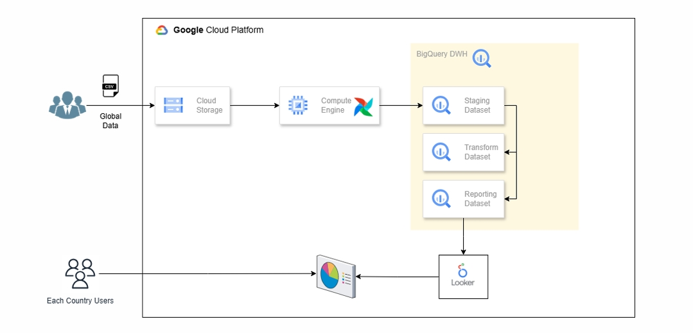
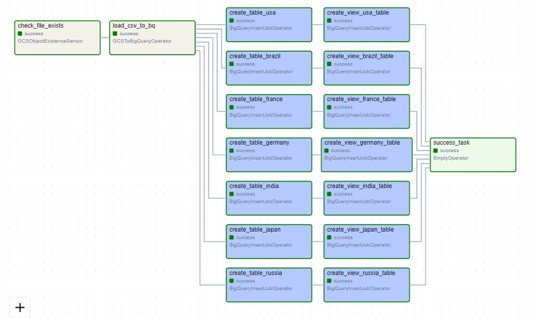
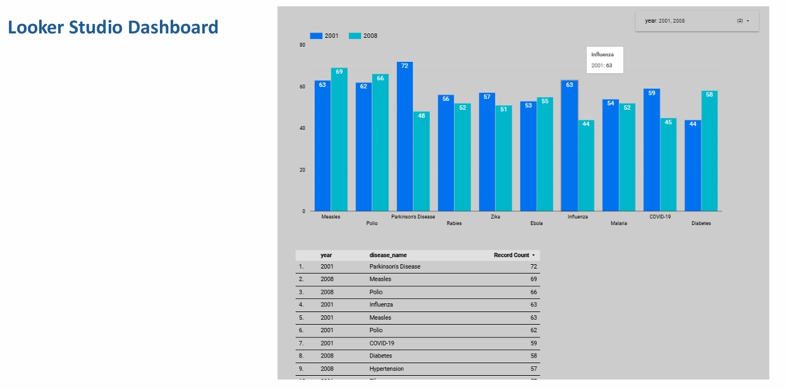

# GCP Healthcare Data ELT Pipeline

An end-to-end **ELT (Extract, Load, Transform) healthcare data pipeline** built on Google Cloud Platform using **Cloud Storage, Apache Airflow, BigQuery, and Looker Studio**.

The pipeline ingests a global healthcare CSV dataset into Google Cloud Storage, loads it into a BigQuery staging layer, transforms the data into country-specific tables, creates reporting views, and exposes the reporting layer through Looker Studio for analytics and visualization.

---

## Architecture

```text
Global Healthcare CSV
        |
        v
Google Cloud Storage
        |
        v
Apache Airflow
(GCS Sensor + BigQuery Operators)
        |
        v
BigQuery - Staging Dataset
        |
        v
BigQuery - Transform Dataset
(country-specific tables)
        |
        v
BigQuery - Reporting Dataset
(country-specific views)
        |
        v
Looker Studio
```

### GCP Architecture

The project architecture follows these major layers:

- **Source:** Global healthcare CSV data
- **Landing:** Google Cloud Storage
- **Orchestration:** Apache Airflow
- **Data Warehouse:** BigQuery
- **Staging Layer:** Raw data loaded from GCS
- **Transformation Layer:** Country-specific tables
- **Reporting Layer:** Filtered BigQuery views
- **Visualization:** Looker Studio

The included architecture diagram also shows Compute Engine as the environment used to host/run the Airflow workflow.

---

## Project Flow

### 1. Source Data

The pipeline starts with:

```text
global_health_data.csv
```

The CSV file is uploaded to the configured Google Cloud Storage bucket.

Default bucket/object used by the DAGs:

```text
Bucket: bkt-src-global-data
Object: global_health_data.csv
```

### 2. File Availability Check

Apache Airflow uses `GCSObjectExistenceSensor` to verify that the source file exists before starting the BigQuery load.

This prevents the ingestion task from running when the expected source file is not available.

### 3. Load into BigQuery

`GCSToBigQueryOperator` loads the CSV from Cloud Storage into the staging table:

```text
tt-dev-02.staging_dataset.global_data
```

The current configuration:

- Source format: CSV
- Header rows skipped: 1
- Field delimiter: `,`
- Schema: Auto-detected
- Write disposition: `WRITE_TRUNCATE`
- Jagged rows: Allowed
- Unknown values: Ignored

This creates the raw/staging layer inside BigQuery.

### 4. Transformation

The transformation DAG creates country-specific tables in the `transform_dataset`.

For example:

```text
transform_dataset.usa_table
transform_dataset.india_table
transform_dataset.germany_table
transform_dataset.japan_table
...
```

Each table is created using a BigQuery SQL transformation similar to:

```sql
SELECT *
FROM `tt-dev-02.staging_dataset.global_data`
WHERE country = 'USA';
```

This allows the same source dataset to be separated into country-level analytical datasets.

### 5. Reporting Views

The final DAG creates reporting views in:

```text
reporting_dataset
```

The views expose selected analytical columns:

- Year
- Disease Name
- Disease Category
- Prevalence Rate
- Incidence Rate

The reporting layer also filters records using:

```sql
WHERE `Availability of Vaccines Treatment` = False
```

This creates a cleaner dataset for downstream reporting and visualization.

### 6. Visualization

The reporting views are connected to **Looker Studio**.

The included dashboard demonstrates healthcare analysis using dimensions such as:

- Year
- Disease Name
- Record Count
- Disease-level comparisons

The dashboard can be extended with filters for country, disease category, year, prevalence rate, incidence rate, and other available healthcare attributes.

---

## Airflow DAGs

The repository contains three main workflow implementations.

### `gcstobq.py`

**DAG:** `load_gcs_to_bq`

Purpose:

```text
GCS -> BigQuery Staging
```

This is the basic ingestion workflow.

### `gcstobq_sensor.py`

**DAG:** `check_load_csv_to_bigquery`

Purpose:

```text
Check GCS file
      |
      v
Load CSV to BigQuery
```

This version adds a GCS existence sensor before ingestion.

### `transformation.py`

**DAG:** `load_and_transform`

Purpose:

```text
GCS file check
      |
      v
Load to staging
      |
      +--> USA table
      +--> India table
      +--> Germany table
      +--> Japan table
      +--> France table
      +--> Canada table
      +--> Italy table
```

The country transformations run independently after the staging load completes.

### `final_view.py`

**DAG:** `load_and_transform_view`

This is the most complete workflow in the project.

It performs:

```text
GCS Sensor
    |
    v
Load CSV to BigQuery
    |
    +--> Create country table
             |
             v
       Create reporting view
             |
             v
        Success task
```

For each configured country, the DAG creates:

1. A country-specific transformation table
2. A reporting view based on that table

---

## BigQuery Data Model

The project uses a three-layer BigQuery design.

### Staging Layer

```text
staging_dataset
└── global_data
```

Purpose:

- Store data loaded from the source CSV
- Preserve the source-level dataset
- Provide the input for downstream transformations

### Transformation Layer

```text
transform_dataset
├── usa_table
├── india_table
├── germany_table
├── japan_table
├── france_table
├── canada_table
└── italy_table
```

Purpose:

- Create country-level datasets
- Prepare data for reporting
- Separate transformation logic from raw/staging data

### Reporting Layer

```text
reporting_dataset
├── usa_view
├── india_view
├── germany_view
├── japan_view
├── france_view
├── canada_view
└── italy_view
```

Purpose:

- Expose only required analytical columns
- Apply reporting filters
- Provide a stable interface for BI tools

---

## Technology Stack

| Technology | Purpose |
|---|---|
| Google Cloud Storage | Source data landing/ingestion |
| Apache Airflow | Workflow orchestration |
| Compute Engine | Airflow execution environment shown in architecture |
| BigQuery | Cloud data warehouse and ELT transformations |
| Looker Studio | Healthcare analytics and visualization |
| Python | Airflow DAG development |
| SQL | BigQuery transformations |

---

## Repository Structure

```text
elt-with-gcp-airflow/
│
├── DAG_flow.jpeg
├── Pipeline_strcture.jpeg
├── Looker-dashboard.jpeg
│
├── gcstobq.py
├── gcstobq_sensor.py
├── transformation.py
└── final_view.py
```

### File Description

| File | Description |
|---|---|
| `gcstobq.py` | Basic GCS-to-BigQuery ingestion DAG |
| `gcstobq_sensor.py` | GCS file availability check followed by ingestion |
| `transformation.py` | Loads data and creates country-specific BigQuery tables |
| `final_view.py` | Complete ingestion, transformation, and reporting-view workflow |
| `Pipeline_strcture.jpeg` | GCP architecture diagram |
| `DAG_flow.jpeg` | Airflow DAG execution graph |
| `Looker-dashboard.jpeg` | Looker Studio dashboard screenshot |

---

## Prerequisites

Before running the project, configure:

1. A Google Cloud project
2. A Cloud Storage bucket
3. A BigQuery dataset for staging
4. A BigQuery dataset for transformations
5. A BigQuery dataset for reporting
6. Apache Airflow with Google Cloud provider packages
7. Appropriate Google Cloud IAM permissions
8. Looker Studio access for dashboard creation

Required Airflow provider:

```bash
pip install apache-airflow-providers-google
```

---

## Google Cloud Setup

### 1. Create Cloud Storage Bucket

Create a bucket and upload:

```text
global_health_data.csv
```

Example:

```text
gs://bkt-src-global-data/global_health_data.csv
```

Update the bucket/object values in the DAG if your names are different.

### 2. Create BigQuery Datasets

Create:

```text
staging_dataset
transform_dataset
reporting_dataset
```

The current DAG configuration uses:

```text
Project: tt-dev-02
```

For another GCP project, update the project ID in the DAG files.

### 3. Configure Airflow

Ensure Airflow has credentials/permissions to:

- Read objects from Cloud Storage
- Create/load BigQuery tables
- Run BigQuery queries
- Create BigQuery views

For production environments, prefer a dedicated service account with least-privilege IAM permissions rather than broad project-level access.

---

## Running the Pipeline

### Step 1: Upload Source Data

Upload:

```text
global_health_data.csv
```

to the configured Cloud Storage bucket.

### Step 2: Start Airflow

Place the DAG files in the Airflow DAG directory.

For example:

```text
$AIRFLOW_HOME/dags/
```

### Step 3: Verify DAGs

In the Airflow UI, verify that the DAGs are available:

```text
load_gcs_to_bq
check_load_csv_to_bigquery
load_and_transform
load_and_transform_view
```

### Step 4: Run the Complete DAG

For the complete pipeline, trigger:

```text
load_and_transform_view
```

The expected execution flow is:

```text
check_file_exists
        |
        v
load_csv_to_bq
        |
        +------------------+
        |                  |
        v                  v
create_table_usa     create_table_india
        |                  |
        v                  v
create_view_usa      create_view_india
        |                  |
        +--------+---------+
                 |
                 v
           success_task
```

Country-specific tasks can run independently after the staging table has been loaded.

---

## ELT Design

This project follows the **ELT** pattern rather than performing transformations before loading.

### Extract

The healthcare dataset originates as a CSV file.

### Load

The source file is loaded into:

```text
Cloud Storage
       |
       v
BigQuery staging_dataset.global_data
```

### Transform

BigQuery performs the transformations using SQL:

```text
staging_dataset
       |
       v
transform_dataset
       |
       v
reporting_dataset
```

This approach takes advantage of BigQuery's scalable SQL processing capabilities and keeps transformation logic inside the analytical warehouse.

---

## Data Quality and Reliability

The pipeline includes several basic reliability mechanisms:

- GCS file existence validation
- Airflow task dependencies
- Airflow retries
- BigQuery `WRITE_TRUNCATE` loading behavior
- Separate staging, transformation, and reporting layers
- Explicit transformation dependencies
- Reporting views instead of exposing raw transformation tables directly

---

## Dashboard

The Looker Studio dashboard provides a reporting layer over the BigQuery data.

Example analysis includes:

- Disease-level record counts
- Year-over-year comparisons
- Disease comparisons
- Interactive year filtering

The dashboard can be expanded to include:

- Country filter
- Disease category filter
- Year filter
- Prevalence rate
- Incidence rate
- Vaccination/treatment availability
- Top diseases by prevalence
- Country-level comparisons

---

## Important Configuration Notes

The current source code contains environment-specific values such as:

```python
project_id = 'tt-dev-02'
bucket = 'bkt-src-global-data'
```

Before deploying the project to another GCP environment, replace these values with your own resources.

For a production implementation, these values should preferably be managed through Airflow Variables, environment variables, or another configuration mechanism instead of hardcoding them in DAG source code.

Also, avoid committing service-account keys or other credentials to the repository.

---

## Current Project Improvements

For a more production-ready version, the following improvements would be valuable:

### 1. Incremental Loading

The current ingestion uses:

```text
WRITE_TRUNCATE
```

A production pipeline could use incremental or partition-based loading.

### 2. BigQuery Partitioning and Clustering

Partitioning by year/date and clustering by commonly filtered dimensions such as country or disease could improve query performance and reduce query costs.

### 3. Data Quality Checks

Add Airflow/BigQuery checks for:

- Null values
- Duplicate records
- Invalid country values
- Invalid disease values
- Invalid prevalence/incidence values
- Unexpected row-count changes

### 4. Centralized Configuration

Move project ID, bucket name, datasets, and country configuration into Airflow Variables or environment-based configuration.

### 5. Monitoring and Alerting

Add:

- Airflow failure notifications
- Cloud Monitoring
- BigQuery job monitoring
- Data freshness checks

### 6. CI/CD

A production version could include automated testing and deployment through GitHub Actions or Google Cloud CI/CD tooling.

---

## Project Highlights

This project demonstrates practical experience with:

- GCP data engineering
- ELT architecture
- Apache Airflow orchestration
- Google Cloud Storage ingestion
- BigQuery data warehousing
- BigQuery SQL transformations
- Staging/transform/reporting data layers
- Dependency-based workflow execution
- Healthcare data analytics
- Looker Studio visualization
- Cloud-based data pipeline design

---

## Architecture Screenshots

### GCP Pipeline Architecture



### Airflow DAG



### Looker Studio Dashboard



---

## Portfolio Summary

This project demonstrates an end-to-end GCP healthcare ELT workflow where healthcare data is ingested from Cloud Storage, orchestrated with Apache Airflow, transformed using BigQuery SQL, exposed through reporting views, and visualized in Looker Studio.

It is designed as a practical demonstration of building a cloud data pipeline with clear separation between ingestion, transformation, reporting, and analytics layers.
